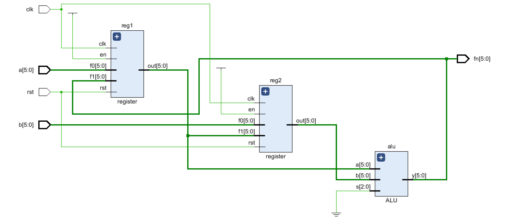
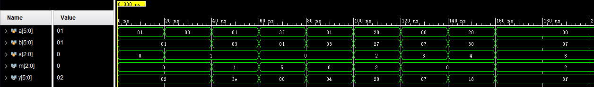
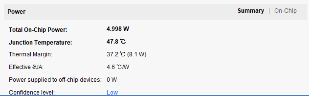
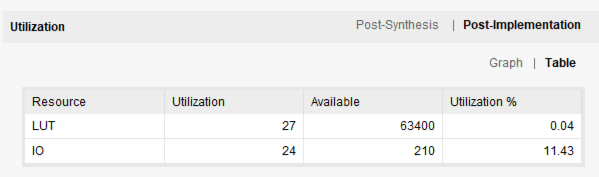
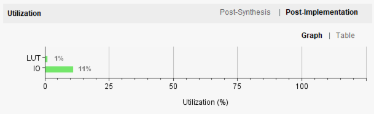
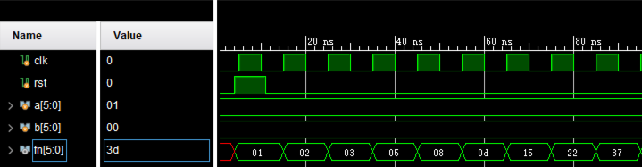
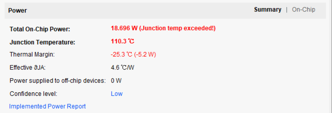
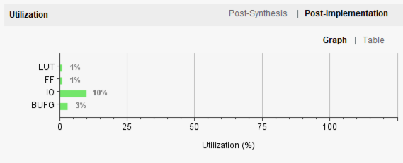
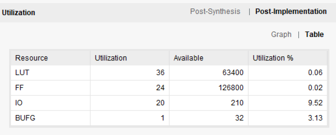

#计算机组成原理  实验报告
##实验题目
LAB01:运算器与寄存器
##实验目的
1. 设计算式逻辑运算单元，用补码的形式实现算术运算（加、减），逻辑运算（与、或、非、异或）；
2. 利用ALU模块与寄存器完成给定初始数的斐波拉契数列。

##实验平台
Vivado（2018.2)

##实验过程
###1.ALU
第一个实验是写一个ALU，要求有两个6位输入、3位操作码、6位输出、3位符号位（进位/借位、溢出、零标志）。  

~~~verilog
module ALU(
    input[5:0] a,
    input[5:0] b,
    input[2:0] s,
    output reg [2:0] m,
    output reg [5:0] y
    );

~~~


对于不同的操作码，对应不同的算术运算和逻辑运算，用永久参数赋值，方便下面使用case语句调用。

~~~verilog

 
    parameter A_ADD=3'b000;
    parameter A_SUB=3'b001;
    parameter A_AND=3'b010;
    parameter A_OR=3'b011;
    parameter A_XOR=3'b100;
    parameter A_NOR=3'b101;
    parameter A_NOT=3'b110;
    reg [5:0] c;
~~~

下面就是具体的ALU执行代码，将他们放在一个always块中，用case语句分开讨论。

  
~~~verilog    
always @(*)
begin
    case(s)
~~~   

对于加法，分两种情况：

1. 两个操作数异号：这种情况，不会产生进位/借位，溢出，所以两个符号码为零，结果也是直接相加即可得到结果；
2. 两个操作数同号：这种情况，最高位不变，符号位由后面5位数字得出。这里溢出的判断是直接使用数电的公式。

~~~
    A_ADD:begin
          if((~a[5]&&b[5])||(a[5]&&~b[5]))
            begin
            y<=a+b;
            m[2:1]=2'b00;
            end
          else 
            begin
            {m[0],y[4:0]}<=a[4:0]+b[4:0];
             m[1]<=a[4]^b[4]^y[4]^m[0];
             y[5]=a[5];
             end
           end
~~~

减法：我采用的办法是先讲减数取反加一，这样就变成了加法，然后再用上面讨论过的方法解决问题就可以了。

~~~
               
    A_SUB:begin
          c<=~b+6'b000001;
          if((~a[5]&&c[5])||(a[5]&&~c[5]))
              begin
              y<=a+c;
              m[2:1]=2'b00;
              end
           else 
              begin
              {m[0],y[4:0]}<=a[4:0]+c[4:0];
              m[1]<=c[4]^c[4]^y[4]^m[0];
              y[5]=c[5];
              end
           end
~~~

剩下的都是逻辑运算，均可以用一个算式表示，并且进位/借位、溢出操作数均为0。

~~~               
            A_AND: begin y<=a&b;m[2:1]=2'b00;end                          
            A_OR: begin y<=a|b; m[2:1]=2'b00;end              
            A_NOT:begin  y<=~a; m[2:1]=2'b00; end         
            A_XOR: begin y<=a^b; m[2:1]=2'b00; end
            default;
            endcase
~~~
在最后，根据得出的结果得出0符号位的结果：

~~~      
            m[2]<=(y==0);//zero 

~~~

###2.斐波拉契数列
首先根据电路图写出寄存器模块：


这是一个有两个输入位，rst，clk和一个输出的寄存器。我讲f0用来连接初始值，每当按下rst时，便重新赋值。

```
module register(
    input [5:0] f0,
    input [5:0] f1,
    input en,
    input rst,
    input clk,
    output reg[5:0] out
    );
    
    always@(posedge clk or posedge rst )
    begin
         if(en)
         begin
            if(rst)
                out=f0;
            else
                out=f1;
         end
    end
endmodule
```
顶层文件如下，是使用了两个寄存器和一个ALU的电路（ALU模块已在上面展示）

```
module top(
   input clk,
   input rst,
   input [5:0]a,
   input [5:0]b,
   output [5:0]fn
    );
    wire [5: 0] c1,c2;
    
    register reg1 (.f0(a),.f1(fn), .en(1'b1),.rst(rst),.clk(clk),.out(c1));
    register reg2 (.f0(b),.f1(c1), .en(1'b1),.rst(rst),.clk(clk),.out(c2));
    ALU alu(.a(c1),.b(c2), .s(3'b000),.y(fn) );
    
endmodule

```
设计如图




##实验结果
###1.ALU
仿真结果


电路性能





###2.斐波拉契






##心得体会

1. 发现对有符号的操作数理解不够深入，写代码的一半时间花在这里；
2. 对电路的理解更加深刻，更熟练的对电路进行分层设计；
