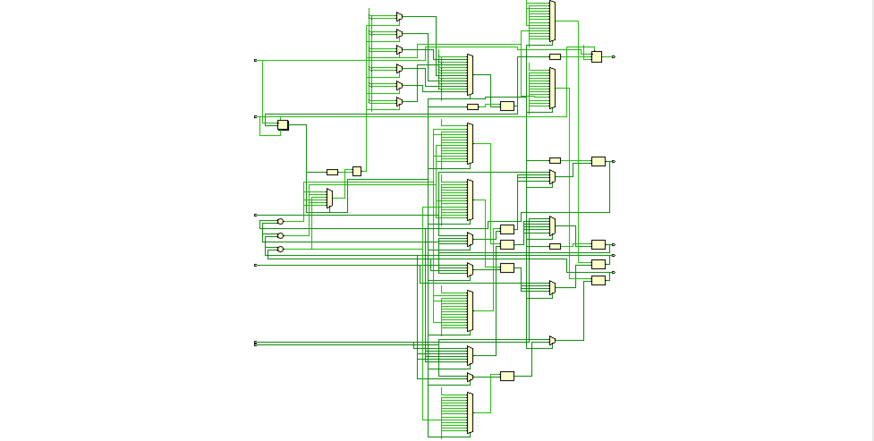
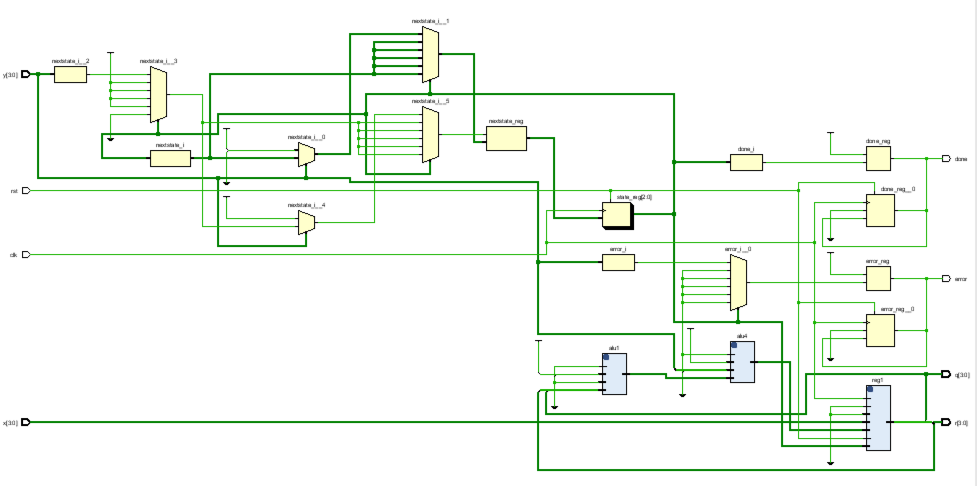
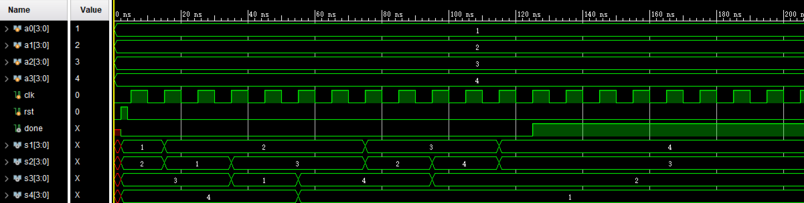
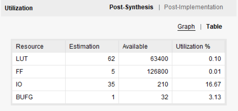
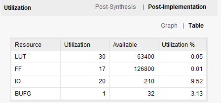
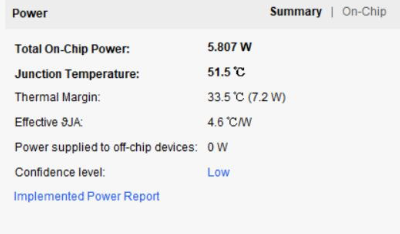

#计算机组成原理  实验报告
##实验题目
LAB02:数据通路和状态机
##实验目的与内容
1. 熟练Vivado的设计实现流程；
2. 模块化、层次化、参数化设计方法；
3. 用状态机实现4个4bit的无符号数的冒泡排序；
4. 用状态机实现两个无符号数相除得到商和余数。

##实验平台
Vivado（2018.2)

##实验过程
###1.冒泡排序
输入输出如图所示，其中done表示排序结束的符号位


~~~verilog
module top(
    input [3:0] x0,x1,x2,x3,
    input rst,
    input clk,
    output reg done,
    output reg [3:0] s0,s1,s2,s3
    );

~~~

分析冒泡排序可以得到：有6次比较，最多有6次交换，加上初始和结束，我设置了14个状态：

~~~verilog
    parameter RST=9'b0001;//重置
    parameter CMP12_1=9'b0010;
    parameter EX12_1=9'b0011;
    parameter CMP23_1=9'b0100;
    parameter EX23_1=9'b0101;
    parameter CMP34=9'b0110;
    parameter EX34=9'b0111;
    parameter CM12_2=9'b1000;
    parameter EX12_2=9'b1001;
    parameter CM23_2=9'b1010;
    parameter EX23_2=9'b1011;
    parameter CMP12_3=9'b1100;
    parameter EX12_3=9'b1101;
    parameter DONE=9'b1110;//结束
~~~

采用三段次态的结构，设计思路是利用4个4位临时寄存器```t0,t1,t2,t3```和一个符号寄存位cf。临时寄存器用于交换相邻数字，cf位比较状态得出的结果，用于状态的跳转。下面和代码一起细细分析。
首先是NextState模块：


~~~verilog

 
    always@(posedge clk or posedge rst)
    begin
        if(rst)
            begin
            state=RST;
            done=0;
            end
        else
           begin
           state=nextstate;
           if(state==DONE)
                done=1;
            end
~~~

接着是CurrentState模块，这里只选取了三个比较有代表性的模块（源码附在了报告末尾），分别是初始状态，比较状态，交换状态和结束状态。对于比较状态，会根据比较结果得出下一个状态。其他则直接跳转到下一个状态，没有分支。

  
~~~verilog    
     case(state)
     RST:
        begin
        nextstate<=CMP12_1;
        end
     CMP12_1:
        begin
        if(cf==1)
            nextstate<=EX12_1;
        else
            nextstate<=CMP23_1; 
        end
     EX12_1:
        nextstate<=CMP23_1;
             DONE:   nextstate<=DONE;
     endcase

~~~   

最后是逻辑输出模块，依旧是挑选几个比较有代表性的来展示。  
对于初始状态，直接将输入的值传递给输出值，并且同时传递给暂存的寄存变量，用于交换状态；  
对于比较状态，如果得到小于的结果，则将对应暂存变量的值改变，同时改写信号变量cf；
对于交换状态，切换到这个状态意味着比较结果是确定的，所以直接赋值即可。


~~~
     case(state)
        RST:
        begin
                {s3,s2,s1,s0}<={x3,x2,x1,x0};
                {t3,t2,t1,t0}<={x3,x2,x1,x0};
        end
        CMP12_1:
        begin
        if(s0<s1)
        begin
            cf=1;
            t0<=s1;
            t1<=s0;
            end
        else 
            cf=0;
        end
        EX12_1:
        begin
            s0<=t0;
            s1<=t1;
        end
~~~

分析电路：


###2.除法器
首先根据电路图写出寄存器模块：


x，y，q，r分别是除数，被除数，商和余数，error用于检测被除数y是否为0，done和上个实验一样用来表示是否已经结束。

```
module top(
    input [3:0]x,
    input [3:0]y,
    input clk,
    input rst,
    output [3:0]q,
    output [3:0]r,
    output reg error,
    output reg done
    );
```  

算法介绍：设```a={4'b0000,x},b={y,4`b0000}```首先左移a一位，然后比较a的高4位和除数，若大则减减b加1，然后继续左移，以此循环，知道4次结束，下面是个例子。


该实验仍然使用三段式，根据设计的除法器的原理，只要右移四次一定可以得到结果，所以加上初始和结束一共5个状态（结束也是一次右移）。

```
    parameter RST=3'b000;
    parameter EXE1=3'b001;
    parameter EXE2=3'b010;
    parameter EXE3=3'b011;
    parameter END=3'b100;


```
首先是Nextstate模块：

```
    always@(posedge clk or posedge rst)
        begin
        if(rst)
            begin
            state<=RST;
            error=0;
            done=0;
            end
        else
           state<=nextstate;
        end


```
接着是CurrentState模块：

```
    always@(state)
        begin
        case(state)
        RST:
            if(y==0)
                begin
                nextstate<=END;
                error<=1;
                end
             else
                nextstate=EXE1;
        EXE1:
                nextstate=EXE2;
        EXE2:
                nextstate=EXE3;
        EXE3:
                nextstate=END;
        END:
            begin
            nextstate=END;
            done=1;
            end
        endcase
        end
        
```

这两个模块和前面的状态机设计思路是一样的，但是在除法器的逻辑输出模块我才用了不一样的风格:使用了一个寄存器模块和两个ALU模块用于表示输出。（register和ALU模块参考附录源码）

```
register 	reg1(.f0(4'b0000),.f1(x),.f2(out1),.rst(rst),.state(state),.out({r,q}),.clk(clk));    
ALU alu1(.r({r,q}),.y(out2),.op(2'b01));  
ALU alu4(.r(out2),.q({y,4'b0000}),.y(out1),.op(2'b11));  
```


设计如图




##实验结果
###1.冒泡排序
仿真结果


电路性能



###2.斐波拉契
仿真结果


电路性能  





##心得体会

1. 对状态机的理解加深了，更加熟练的写三段式；
2. 说对阻塞和非阻塞有了更深层次的理解；
3. 我一开始状态机的编码不仅用于标志状态，也作为信号量，但是这其中出现了不少bug，发现有的可以作为信号量，有的不可以，处理起来确实比较麻烦。后来索性不这样了，状态的编号与信号分开来会思路会清晰不少；
4. 一个好的电路是仿真和下在都能过的，我遇到过几次仿真一点问题没有但是下载却不对的，因为下载是实际情况，考虑的东西会变多。所以我们在写代码的时候应该以下载的要求要求自己，从大局观出发；
5. 希望PPT的内容可以详细一些，只有一个图有时候不知道什么意思，有的要求也是后来在群里才提出来的，希望细化要求。

---
---


##源码

###冒泡排序


```
module top(
    input [3:0] x0,x1,x2,x3,
    input rst,
    input clk,
    output reg done,
    output reg [3:0] s0,s1,s2,s3
    );

    reg cf;
    reg [3:0] state,nextstate;
    reg [3:0] t3,t2,t1,t0;

    parameter RST=9'b0001;
    parameter CMP12_1=9'b0010;
    parameter EX12_1=9'b0011;
    parameter CMP23_1=9'b0100;
    parameter EX23_1=9'b0101;
    parameter CMP34=9'b0110;
    parameter EX34=9'b0111;
    parameter CM12_2=9'b1000;
    parameter EX12_2=9'b1001;
    parameter CM23_2=9'b1010;
    parameter EX23_2=9'b1011;
    parameter CMP12_3=9'b1100;
    parameter EX12_3=9'b1101;
    parameter DONE=9'b1110;
    
    always@(posedge clk or posedge rst)
    begin
        if(rst)
            begin
            state=RST;
            done=0;
            end
        else
           begin
           state=nextstate;
           if(state==DONE)
                done=1;
            end
     end
 
 always@(state or cf)
     begin
     case(state)
     RST:
        begin
        nextstate<=CMP12_1;
        end
     CMP12_1:
        begin
        if(cf==1)
            nextstate<=EX12_1;
        else
            nextstate<=CMP23_1; 
        end
     EX12_1:
        nextstate<=CMP23_1;

     CMP23_1:
        begin
            if(cf==1)
                nextstate<=EX23_1;
            else
                nextstate<=CMP34;

        end
     EX23_1:
        nextstate<=CMP34;
        
     CMP34:
        begin
            if(cf==1)
                nextstate<=EX34;
            else
                nextstate<=CM12_2;
        end
     EX34:
      nextstate<=CM12_2;
     CM12_2:
        begin
        if(cf==1)
            nextstate<=EX12_2;
        else
             nextstate<=CM23_2;
        end
     EX12_2: 
     nextstate<=CM23_2;
     CM23_2:
        begin
        if(cf==1)
            nextstate<=EX23_2;
        else
            nextstate<=CMP12_3;
        end
     EX23_2:
      nextstate<=CMP12_3;
     CMP12_3:
        begin
        if(cf==1)
            nextstate<=EX12_3;
        else
         nextstate<=DONE;
        end
     EX12_3: nextstate<=DONE;
     DONE:   nextstate<=DONE;
     endcase
     end 
     
    always@(state)
    begin
        case(state)
        RST:
        begin
                {s3,s2,s1,s0}<={x3,x2,x1,x0};
                {t3,t2,t1,t0}<={x3,x2,x1,x0};
        end
        CMP12_1:
        begin
        if(s0<s1)
        begin
            cf=1;
            t0<=s1;
            t1<=s0;
            end
        else 
            cf=0;
        end
        EX12_1:
        begin
            s0<=t0;
            s1<=t1;
        end
        CMP23_1:
        if(s1<s2)
                 begin
                    cf=1;
                    t1<=s2;
                    t2<=s1;
                 end
                    else cf=0;
        EX23_1:
        begin
                    s1<=t1;
                    s2<=t2;
                end
        CMP34:
        if(s2<s3)
                 begin
                    cf=1;
                    t2<=s3;
                    t3<=s2;
                 end
                    else cf=0;
        EX34:begin
                            if(cf)
                            begin
                                s2<=t2;
                                s3<=t3;
                            end
             end
        CM12_2:
        begin
                if(s0<s1)
                begin
                    cf=1;
                    t0<=s1;
                    t1<=s0;
                    end
                else 
                    cf=0;
                end
            
        EX12_2:
        begin
                    s0<=t0;
                    s1<=t1;
                end
        CM23_2:
        if(s1<s2)
                 begin
                   cf =1;
                    t1<=s2;
                    t2<=s1;
                 end
                    else cf=0;
        EX23_2:
        begin
                    s1<=t1;
                    s2<=t2;
                end
        CMP12_3:
        begin
                if(s0<s1)
                begin
                    cf=1;
                    t0<=s1;
                    t1<=s0;
                    end
                else 
                    cf=0;
                end
                EX12_3:
                        begin
                    s0<=t0;
                    s1<=t1;
                end
  
        endcase
    end
    
endmodule

```

###除法器

```
module top(
    input [3:0]x,
    input [3:0]y,
    input clk,
    input rst,
    output [3:0]q,
    output [3:0]r,
    output reg error,
    output reg done
    );
    parameter RST=3'b000;
    parameter EXE1=3'b001;
    parameter EXE2=3'b010;
    parameter EXE3=3'b011;
    parameter END=3'b100;
    
     reg [2:0] state;
     reg [2:0] nextstate;
     
 
    always@(posedge clk or posedge rst)
        begin
        if(rst)
            begin
            state<=RST;
                error=0;
            done=0;
            end
        else
           state<=nextstate;
        end
    
    always@(state)
        begin
        case(state)
        RST:
            if(y==0)
                begin
                nextstate<=END;
                error<=1;
                end
             else
                nextstate=EXE1;
        EXE1:
                nextstate=EXE2;
        EXE2:
                nextstate=EXE3;
        EXE3:
                nextstate=END;
        END:
            begin
            nextstate=END;
            done=1;
            if(y==0)
                error=1;
            end
        endcase
        end
    wire [7:0] out1,out2;
    wire s;
    register reg1(.f0(4'b0000),.f1(x),.f2(out1),.rst(rst),.state(state),.out({r,q}),.clk(clk));    
    ALU alu1(.r({r,q}),.y(out2),.op(2'b01));
    ALU alu4(.r(out2),.q({y,4'b0000}),.y(out1),.op(2'b11));

        
endmodule

module register(
    input [3:0] f0,
    input [3:0] f1,
    input [7:0] f2,
    input en,
    input rst,
    input clk,
    input [2:0] state,
    output reg [7:0] out
    );
    
    always@(posedge rst or posedge clk )
    begin

            if(rst)
                out={f0,f1};
            else if(state<3'b100)
                out=f2;
    end
endmodule

module ALU(
    input[7:0] r,
    input[7:0] q,
    input [1:0]op,
    input cf,
    output reg m,
    output reg [7:0] y
    );
 
    parameter CMP=2'b00;
    parameter LS=2'b01;
    parameter ADD=2'b10;
    parameter DIV=2'b11;

    
    
     always@(*)
    begin
        case(op)
       CMP:
        begin
            if(r[7:4]<q[7:4])
                 m=1;
            else 
                m=0;  
                
        end
       LS:
            y=r<<1;
       ADD:
        if(cf==0)
            y=r-{q,4'b0000}+1;
        else
            y=r;
       DIV:
            if(r[7:4]<q[7:4])
                y=r;
             else 
              y=r-{q[7:4],4'b0000}+1;
        default;
        endcase
  
    end
endmodule

```

