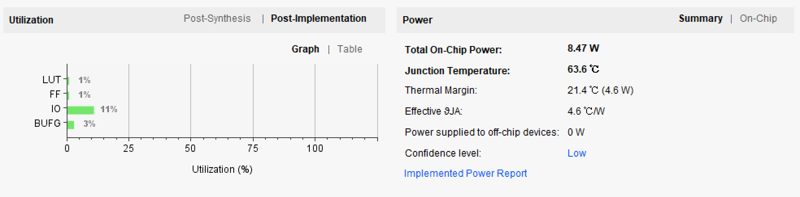
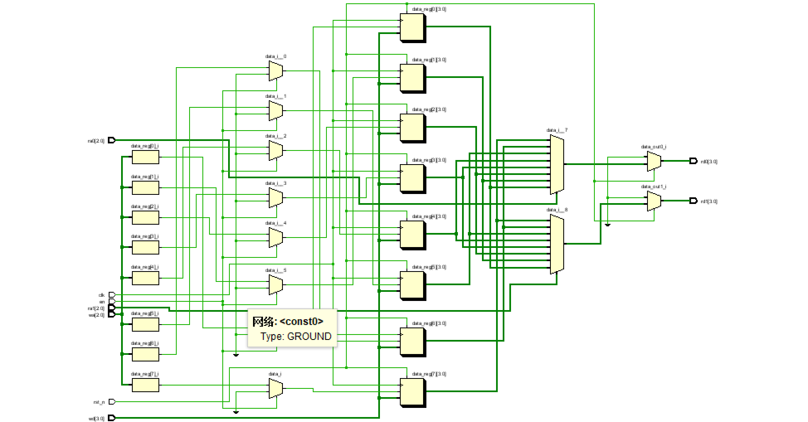
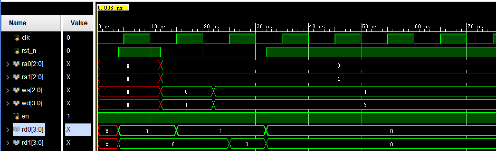
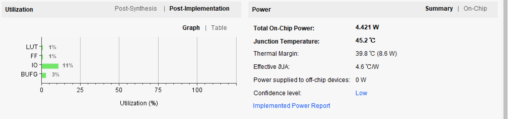
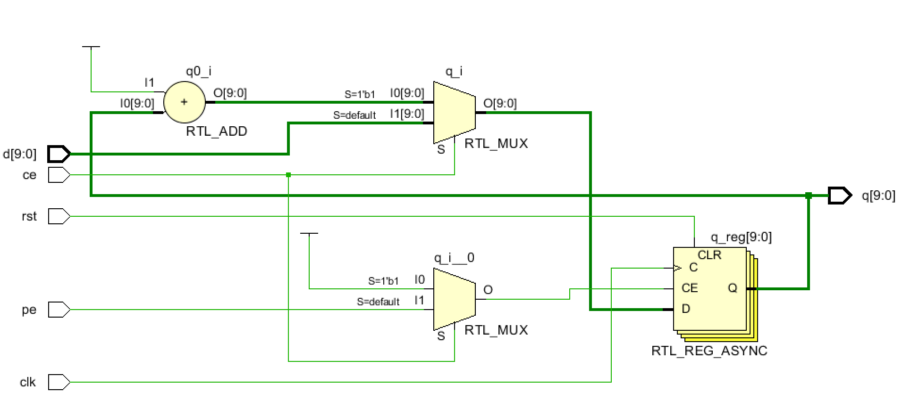
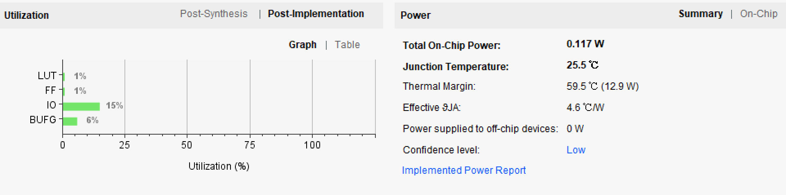
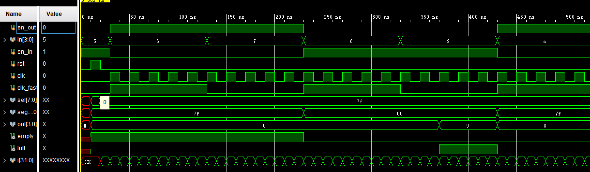

#计算机组成原理  实验报告
##实验题目
LAB03:寄存器堆与计数器
##实验目的与内容
1. 熟练Vivado的设计实现流程；
2. 模块化、层次化、参数化设计方法；
3. 实现寄存器堆；
4. 实现计数器；
5. 用寄存器堆和适当逻辑实现最大长度为8的FIFO队列。

##实验平台
Vivado（2018.2)

##实验过程

###寄存器堆

####I/O模块
```
module Register_File(
	 input clk,
    input rst_n,
    input [2:0] ra0,//读地址1
    input [2:0] ra1,//读地址2
    input [2:0] wa,//写地址
    input [3:0] wd,//写数据
    input en,//使能信号
    output [3:0] rd0,//读数据1
    output [3:0] rd1//读数据2
    );
    
```
####变量设置

```
  reg [3:0] data [7:0];
  reg [3:0] data_out0,data_out1;
```
其中reg型变量data充当寄存器，用来存储写进来的数据；data_out0/1是输出时所用到的reg型变量。
####模块实现

要求的功能是同步写与异步读，所以分两个 always 模块来写：  
同步写： 

```
   always @(posedge clk or posedge rst_n)
    begin
        if (rst_n)//当rst触法时，所有寄存器设置为0；
            begin
            data[0] <= 4'b0000;
            data[1] <= 4'b0000;
            data[2] <= 4'b0000;
            data[3] <= 4'b0000;
            data[4] <= 4'b0000;
            data[5] <= 4'b0000;
            data[6] <= 4'b0000;
            data[7] <= 4'b0000;
            end
        else if (en)
            data[wa] <= wd;
    end
```

异步读(敏感信号设置为全部)：

```
    assign rd0 = data_out0;
    assign rd1 = data_out1;
    
    always @(*)
    begin
    if(rst_n)
    begin
        data_out0=4'b0000;//读数据的寄存器也要清零
        data_out1=4'b0000;
    end
    else
    begin
        data_out0=data[ra0];
        data_out1=data[ra1];
    end
    end
```


###计数器

####I/O

```
module Counter(
    input clk,
    input rst,
    input ce,//
    input pe,//
    input [9:0] d,//n=10
    output reg [9:0] q
    );
```
####实现
要求在计数器的基础上加入同步装数使能，即用if-else加上分支即可：

```
    always@(posedge clk or posedge rst)
    begin
    if(rst)
        q<=0;
    else if(ce)
        q<=q+1;
    else if (pe)
        q<=d;
    end

```


###最大长度为8的FIFO循环队列


###I/O

```
module top(
    input en_out,//出队列使能信号
    input [3:0] in,//近队列数字
    input en_in,//近队列使能信号
    input rst,
    input clk,
    input clk_fast,//用于分频的始终信号，使用半载100Mhz
    output [7:0] sel,//display，七位段数码管的分频使能信号
    output [7:0] segment,//display，七位段数码管使能信号
    output [3:0] out,//出队列的数据
    output  empty,//显示队列是否空的信号
    output  full//显示队列是否满的信号
    );
```

###变量设置

```
    reg [2:0] head;//用于指向队列头的指针
    reg [2:0] tail;//用于指向队列尾的指针
    reg [7:0] data;//用于记录数据的位置
    reg [3:0] flag;//用于记录队列中数据数量的寄存器
    wire count_clk;//从counter中分频的信号
    wire [2:0] count_seg;//从counter中分频出来用于切换七位段数码管的信号
    wire en; //寄存器堆使能信号
    wire [3:0]reg_data;//从寄存器堆中读出的数据
```

###设计思路
在top文件中，包含连线寄存器堆（Register_ File），计数器（counter），和显示（display）模块，并在其中写一个用于操作head和tail指针的模块。  
其中counter将板载100Mhz频率减弱，并输出count_ seg这个3位的信号，用于在display中分频和在Register_ File中读出要显示的数据（reg_ data)，在将这个数据送入display模块中显示。

###实现

wire型变量设置


```
    assign empty=(flag==0)?1:0;//当数据队列为0时，empty置1
    assign full=(flag==8)?1:0;//当数据队列为8时，full置1
    assign en=en_in&&(~full);//这是Register堆的使能信号，当在不满和写入状态下可以置1
    
```

top模块中对指针的设计：

```
   always@(posedge clk or posedge rst)
   begin
   if(rst)
        begin
        head<=0;
        tail<=0;
        data<=7'b0000_000;//rst时，所有数据不显示
        flag<=3'b0;//rst时，队列为空
        end
   else
        begin
        if(en_in && ~en_out&&~full)//近队列操作条件
            begin
            data[tail]<=1;//该数字可以显示
            tail<=(tail+1)%8;//尾指针后移
            flag<=flag+1;    //队列数据+1
            end
        if(en_out&&~en_in&&~empty)//出队列操作条件
            begin
            data[head]<=0;//该数字禁止显示
            head<=(head+1)%8;//头指针后移
            flag<=flag-1;//队列数据-1
            end            
        end     
  end 
  
```

top文件中对其他模块的调用：

```
  
  counter counter1(
    .clk(clk_fast),
    .rst(rst),
    .count_clk(count_clk),
    .count_seg(count_seg)
     );
     
   display display1(
     .clk(count_clk),
     .rst(rst),
     .data(data),
     .sel(sel),
     .segment(segment),
     .reg_data(reg_data),//用于显示数据
     .count_seg(count_seg),
     .head(head)//head指针进入用于小数点的显示
     );
     
         
   Register_file reg_file(
       .clk(clk),
       .rst_n(rst),
       .ra0(head-1),//出队列的那个数据应该是出队列后head指针的前一个数据
       .ra1(count_seg),//ra1用分频信号驱动
       .wa(tail),//写数据用tail指针定位
       .wd(in),
       .en(en),
       .rd0(out),//出队列的数据
       .rd1(reg_data)//用于显示的数据
        );

```

Register_File：
寄存器堆模块和上面实验1一样，这里就不再重复展示了。  

counter：

```
module counter(
    input clk,
    input rst,
    output count_clk,
    output [2:0] count_seg
    );
    reg    [13:0]    cnt;  //14位的计数变量   
    always@(posedge clk or posedge rst)
    begin
    if(rst)
        cnt    <= 14'd0;
    else if(cnt >= 14'd12999)
        cnt    <= 14'd0;
    else
        cnt    <= cnt + 14'd1;
    end
    assign count_clk =  (cnt == 14'd12999) ? 1'b1 : 1'b0;//时钟的分屏信号
    assign count_seg[2:0] = cnt[12:10]; ///取其中3bit用于表示8个七位段数码管的现实
    
    endmodule

```
 
 display
 
 ```
 module display(
	input clk,
	input rst,
	input [7:0] data,
	input [3:0] reg_data,
	input [2:0] count_seg,
	input [2:0] head,
	output reg [7:0] sel,
	output  [7:0] segment
	);
	reg [2:0] counter;
	reg [6:0] seg;
	reg point;
	wire [7:0] segment_clk ;
    assign segment[7]=point;//用于表示小数点的信号
    
    //decode 一个将4位信号转化为七位段数码管上用于显示的模块，具体代码在附录中展示
	decode digit1(
	.en(data[count_seg]),//将使能信号输入，检测队列此处是否有数据，若无，则七位段数码管不亮
	.hex(reg_data[3:0]),
	.data(segment[6:0])
	);
		
	always @(count_seg or  rst)
	 begin
	 	if (rst)
	 	 begin
	 	 	counter<=3'd0;
	 	 	sel<=8'b0;
	 	 end
	 	 else begin
	 	 case (count_seg)//用count_seg来分频
         3'd0: begin sel<=8'b01111111;if(head==0) point<=0;else point<=1; end
         3'd1: begin sel<=8'b10111111;if(head==1) point<=0;else point<=1; end
         3'd2: begin sel<=8'b11011111;if(head==2) point<=0;else point<=1; end
         3'd3: begin sel<=8'b11101111;if(head==3) point<=0;else point<=1; end
         3'd4: begin sel<=8'b11110111;if(head==4) point<=0;else point<=1; end
         3'd5: begin sel<=8'b11111011;if(head==5) point<=0;else point<=1; end
         3'd6: begin sel<=8'b11111101;if(head==6) point<=0;else point<=1; end
         3'd7: begin sel<=8'b11111110;if(head==7) point<=0;else point<=1; end
         endcase//head位的值的情况小数点要显示
	 	 end
	 end
endmodule
 ```


##实验结果
###寄存器堆
电路性能：


RTL分析：


仿真：



###计数器
电路性能：


RTL分析：


###最大长度为8的FIFO循环队列

电路性能：


仿真：


下载照片：


##心得体会

1. 更加熟悉分频的模块；
2. 对组合逻辑和时序逻辑有了更深层次的理解；
3. 更加清楚的认识到了自顶向下设计的思路；
4. 实验中出现过只有第八位数字无法显示的情况，后来发现是分频后的频率过小以致于无法显示；
5. 一开始写的时候不知道为什么始终下载板子后无法正常运行，后来用counter作为计数器信号量时才好。我对原因至今不能理解，并且发现仿真的时候无法实例化一些我本来设置好的reg型变量。虽然不知道为什么错误，但是我以后尽量wire型变量作为信号量传递信息。

##附录（其他源码）
译码模块
```
module decode(
    input en,
    input [3:0] hex,
    output reg [6:0] data
    );

	always @(*)
	begin
	if(~en)
	   data=8'b1111_111;
	else
	   case(hex)
			4'h0: data = 8'b1000_000;
			4'h1: data = 8'b1001_111;
			4'h2: data = 8'b0010_010;
			4'h3: data = 8'b0000_110;
			4'h4: data = 8'b1001_100;
			4'h5: data = 8'b0100_100;
			4'h6: data = 8'b0100_000;
			4'h7: data = 8'b0001_111;
			4'h8: data = 8'b0000_000;
			4'h9: data = 8'b0000_100;
			4'hA: data = 8'b0001_000;
			4'hB: data = 8'b1100_000;
			4'hC: data = 8'b0110_001;
			4'hD: data = 8'b1000_010;
			4'hE: data = 8'b0110_000;
			4'hF: data = 8'b0111_000;
			default: data = 8'b1111_111;
		endcase
	end	
endmodule
```
lab3_3的测试文件

```
module test(

    );

    reg clk;
    reg rst_n;
    reg [2:0] ra0;
    reg [2:0] ra1;
    reg [2:0] wa;
    reg [3:0] wd;
    reg en;
    wire [3:0] rd0;
    wire [3:0] rd1;

    
   Register_File  DUT(clk,rst_n,ra0,ra1,wa,wd,en,rd0,rd1);
   
 initial begin
       clk=0;
       rst_n=0;
       en=1;
       #4 rst_n=1;
       #8 rst_n=0;
       ra0=3'b000;
       ra1=3'b001;
       wa=3'b000;
       wd=3'b001;
       #10
       wa=3'b001;
       wd=3'b011;       
       #10 rst_n=1;
       end
       
       
   always
   begin
   #5 clk=~clk;
   end
   endmodule

```


lab3_3的测试文件

```
module test1(

    );

 
    reg en_out;
    reg [3:0] in;
    reg en_in;
    reg rst;
    reg clk;
    reg clk_fast;
    wire [7:0] sel;
    wire [6:0] segment;
    wire [3:0] out;
    wire empty;
    wire full;
        integer i;


    
   top  DUT(
        .en_out(en_out),
        .in(in),
        .en_in(en_in),
        .rst(rst),
        .clk(clk),
        .clk_fast(clk_fast),
        .sel(sel),
        .segment(segment),
        .out(out),
        .empty(empty),
        .full(full)

        );
          initial begin
          clk=0; clk_fast=0; rst=0; en_out=0; en_in=1; in=5;
          #10 rst=1;
          #10 rst=0;
          for(i=0;i<200;i=i+1)
          begin
          #10 clk=~clk;
          if(i%10==0)
          begin
          clk_fast=~clk_fast;
          in=in+1;
          end
          if(i%20==0)
          begin
          en_out=~en_out;
          en_in=~en_in;
          end
          end
       end
      endmodule

```


