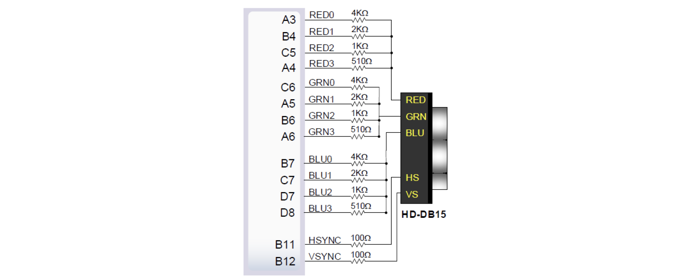
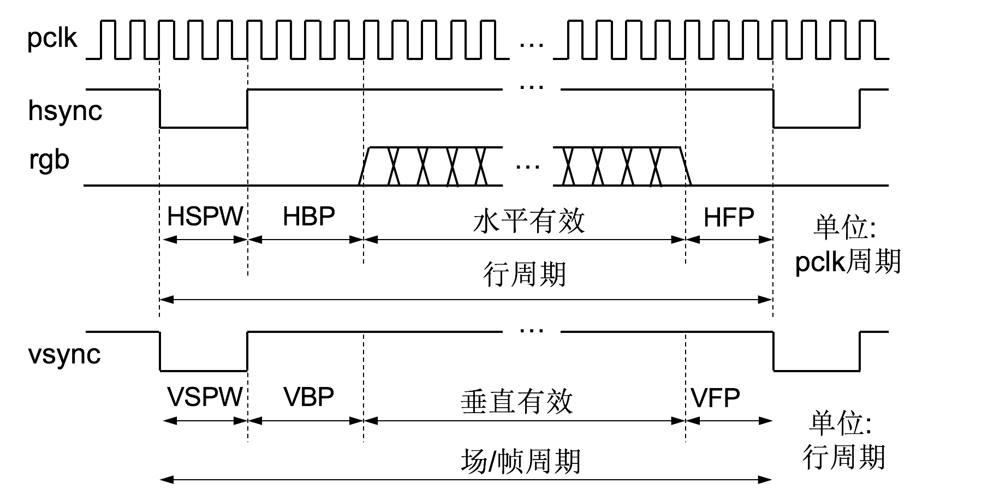
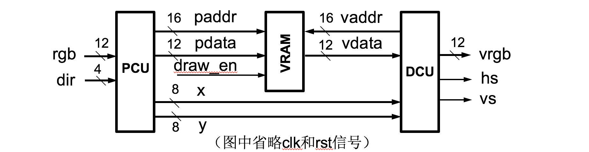
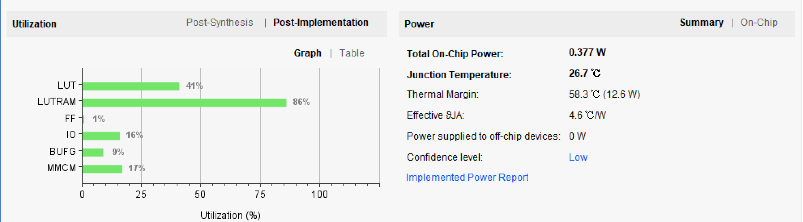

#计算机组成原理  实验报告
##实验题目
LAB04:存储器与显示控制器
##实验目的与内容
1. 熟练Vivado的设计实现流程；
2. 模块化、层次化、参数化设计方法；
3. 控制画笔在800x600分辨率的显示器上随意涂画，画笔的颜色12位(红r绿g蓝b各4位)，绘画区域位于屏幕正中部，大小为256x256.

##实验平台
Vivado（2018.2)

##实验原理

1. VGA接口：
	- R：红色深度值
	- G：绿色深度值
	- B：黄色深度值
	- HS：水平同步信号，也称行同步
	- VS：垂直同步信号，也称场同步
 
2. VGA时序：显示器的采用逐行扫描方式，由屏幕左上方出发逐行向右下方扫描。即每当扫描完一行的每一个节点时，开始扫描下一行。扫描一行的频率为行频率，扫完一帧的频率为场频率。  

  	每一个周期有四个不同的阶段：
  	
  	- HBP(VBP)：表示从水平（垂直）同步信号开始到一行的有效数据开始之间的PCLK的个数；
	- HFP(VFP)：表示一行（列）的有效数据结束到下一个水平（垂直）同步信号开始之间的PCLK的个数；
	- 水平（垂直）有效：这一阶段是有效阶段，会从存储器中读取并显示；
	- HSPW(VSPW)：表示水平同步信号的宽度，以PCLK为单位计算。	
  	 


##实验设计
设计分为三大模块，如图所示：

（注：这里于讲义上不同的是，我将画笔使能信号端直接输入VRAW，而不是经过PCU再传到VRAW）

1. PCU：（Paint Control Unit）：用于控制画笔，并向VRAM异步写入像素信息（RGB值）；

2. VRAW：视频存储器，存储256x256个像素的颜色信息，采用简单双端口存储器实现；

3. DCU：（Display Control Unit）：显示控制单元，读取VRAW中的像素信息，并根据始终产生行、列信号。


##实验参数
显示模式： 

- 分辨率：800x600
- 刷新频率：72Hz
- 像素时钟频率：50MHz

VGA时序：

- HSPW=120
- HBP=64
- H_en=800
- HFP=56
- H_SUM=1040
- VSPW=6
- VBP=23
- V_en=600
- VFP=37
- V_SUM=666;


##具体实现与代码讲解
采用自定向下的模式讲解，首先是顶层模块：

###top

I/O

```
module top(
    input [11:0]rgb,//12位rgb信息
    input [3:0] dir,
    input en_draw,
    input clk,
    input rst,
    output [3:0]vga_r,
    output [3:0]vga_g,
    output [3:0]vga_b,
    output vga_hs,
    output vga_vs
    );
    
```
变量设置

```
    wire [7:0]x,y;//由PCU向DCU传递画笔的中心位置
    wire [15:0]paddr;//PCU向VRAM同步写地址
    wire [11:0]pdata;//PCU向VRAM同步写数据
    wire clk_slow;//分频后的时钟信号
    wire [15:0]vaddr;//DCU向VRAM异步读地址
    wire [11:0]vdata;//DCU向VRAM异步读数据
```

模块连接：  
top分为如下4个模块

```
    clk_wiz tranfer(
        .clk_in(clk),
        .clk_out(clk_slow),
        .reset(rst)
        );//分频IP核，将板载100MHz时钟输入，输出50MHz时钟
    
    dist_mem_gen VRAM(
        .a(paddr),
        .d(pdata),
        .clk(clk_slow),
        .we(en_draw),
        .dpo(vdata),
        .dpra(vaddr)
        );//distrubted memory IP核，用于存储像素信息，支持同步写，异步读
   
    PCU pcu(
        .clk(vga_vs),
        .rst(rst),
        .rgb(rgb),
        .dir(dir),
        .x(x),
        .y(y),
        .paddr(paddr),
        .pdata(pdata)
        );//Paint Control Unit
        
    DCU dcu(
        .clk(clk_slow),
        .rst(rst),
        .x(x),
        .y(y),
        .vdata(vdata),
        .vaddr(vaddr),
        .vga_r(vga_r),
        .vga_g(vga_g),
        .vga_b(vga_b),
        .vga_hs(vga_hs),
        .vga_vs(vga_vs)
    	  );//Display Control Unit
```

###DCU
DCU是现实控制单元，通过分频后的时钟周期产生设定好的参数hsync和vsync信号，并且异步读VRAM并接受像素信息。  

其中为了实现画板在屏幕中间的条件，必须手动算几个参数：UP，DOWN，LEFT，RIGHT，因为行列分别有800，600个有效周期，而我们只需要各256个，所以可得：

$$ UP=\frac {600-256}{2}=172 $$
$$ DOWN=172+256=428 $$
$$ LEFT=\frac{800-256}{2}=272 $$
$$ RIGHT=272+256=528 $$

同时我们需要添加十字光标的功能，以方便我们确定画笔的位置，因为我们设置画板背景是白色的，所以我们只需要在信号扫到十字光标所在的位置时，输出黑色的RGB信息，光标的图案就出来了。在本次实验中我们设置十字光标的上下左右长度各为5个像素点。

####变量设置
这些都是一些比较重要的信号，下面来一一介绍：

```
	wire [7:0]x_clk,y_clk;
	/*这个用于算出此时扫描的点相对画布左上角的时钟周期的个数，设置这个变量是为了方便区分不同的
	区域：背景、画板、十字光标。*/
    reg[11:0]h_clk,v_clk;
    //用于记录每一个大周期内的周期数
    wire background_singal,paper_singal,cross_singal;
    //区别不同区域的信号量：是否在有效区域内，是否在画板范围内，是否在十字范围内。
```

####模块实现

assign模块

```
  	assign x_clk=h_clk -(HSPW+HBP-1)- LEFT;
    assign y_clk=v_clk -(VSPW+VBP-1)- UP;
    //计算出相对于画布左上角的距离
    assign vaddr=(paper_singal && background_singal) ? {x_clk,y_clk} : 0;
    //当扫描的点在画板内并且在有效区域时，读的地址为画布上的坐标，否则是0，即黑色。
```
信号量设置
	
```    
    assign cross_singal=(((x_clk<=x+cross_width)&&(x_clk>=x-cross_width))&&(y_clk==y))||(((y_clk<=y+cross_width)&&(y_clk>=y-cross_width))&&(x_clk==x));
    //可以把十字光标看成两条线段，满足这两条线段的任意一条信息就属于光标内。
    assign background_singal = (x_clk+LEFT > 0) && (h_clk < H_SUM-HFP) && (y_clk+UP > 0) && (v_clk < V_SUM-VFP);  
    //在有效信号内则为1，否则为0；
    assign paper_singal = (x_clk>=0 ) && (x_clk< RIGHT-LEFT) && (y_clk>= 0) && (y_clk< DOWN-UP);  
    //坐标在0-256内即在画布内，置1，否则置0；    
        
```


always模块

```
 	//当时钟上升沿时，行周期加1；
    always @(posedge clk or posedge rst) 
    begin  
         if (rst) 
           h_clk <= 12'd0;  
         else if (h_clk == H_SUM-1)
           h_clk <= 12'd0;
         else
           h_clk <= h_clk + 1;  
    end  
    
    //当列扫描完之后，行周期数加1；
         
    always @(posedge clk or posedge rst) 
    begin  
         if (rst)
           v_clk <= 12'd0;  
         else if (v_clk ==V_SUM-1)
           v_clk <= 12'd0;  
         else if (h_clk == H_SUM-1)
           v_clk <= v_clk + 1;
   end  
   
    //根据时钟输出hsync信号；
        
    always @(posedge clk or posedge rst) 
    begin  
         if (rst)
           vga_hs <= 1'b0;
         else if (h_clk == 0)
           vga_hs <=1'b0; 
         else if (h_clk == HSPW-1)
           vga_hs <= 1'b1;
   end 
       
     //根据时钟输出vsync信号；
    always @(posedge clk or posedge rst) 
    begin  
         if (rst) 
           vga_vs <= 1'b0;
         else if (v_clk == 0)
           vga_vs <=1'b0;
         else if (v_clk == VSPW-1)
           vga_vs <= 1'b1;
    end    
    
    //根据前面提及的信号量background_signal,cross_signal,paper_signal，决定输出的像素RGB的值
      always @(posedge clk or posedge rst) begin  
        if (rst) 
           { vga_r,vga_b,vga_g} <=12'b0;
       else if(background_singal&&cross_singal)
            {vga_r,vga_g,vga_b}<=12'b0;//十字框，黑色
       else if(background_singal&&paper_singal)
            {vga_r,vga_g,vga_b}<=vdata;//寄存器堆里的信息
       else if(background_singal)
            {vga_r,vga_g,vga_b}<=12'b0;//画布之外，黑色
        end  
        
```

###PCU

PCU是绘画控制单元，通过上下左右四个按钮来实现画笔的移动，要实现点移动，线移动，对角移动。此外，还向VRAM异步写入RGB值。在这个模块里，调用了Move_Control模块，它是光标移动的控制模块，因为有四个方向，所以调用了4次。

####变量设置

```
    wire [3:0] en_dir;
    //使能信号
```

####模块实现
assign模块

```
    assign paddr={x,y};
    //写地址
    assign pdata={rgb};
    //写数据
```

Move_Contol模块

```
module Move_control(
    input clk,
    input rst,
    input dir,
    output en_dir
    );
    reg [20:0]cnt;
    assign en_dir=(cnt == 1) || (cnt >= 100);
    //这里的100是一个参数值，当cnt级数大于100时可以连续移动
    
    always @(posedge clk or posedge rst)
    begin
    if(rst)
        cnt<=0;
    else if(en_dir)//连续移动
        cnt<=cnt+1;
    else 
        cnt<=0;
    end
endmodule
```

调用模块

```   
	//上下左右
	Move_control dir1(clk,rst,dir[0],en_dir[0]);
    Move_control dir2(clk,rst,dir[1],en_dir[1]);
    Move_control dir3(clk,rst,dir[2],en_dir[2]);
    Move_control dir4(clk,rst,dir[3],en_dir[3]);

```

always模块

```
 //光标的控制模块
 always @(posedge clk or posedge rst)
    begin
        if(rst)//光标回到画布中心
        begin
            x <= 8'd128;
            y <= 8'd128;
        end
        else
        begin 
            if(en_dir[0]&&y>0)
            y<=y-1;
            else if(en_dir[1]&&y<255)
            y<=y+1;
            if(en_dir[2]&&x>0)
            x<=x-1;
            else if(en_dir[3]&&x<255)
            x<=x+1;
        end
    end

```
##实验结果

电路性能：

下载照片：


##心得体会

1. 对vga输出有了深层次的了解；
2. 发现当懂了原理后，其实并不难，逻辑非常大鹅清晰，代码写起来很快，虽然这期间有bug，但是很快就调试好了；
3. 主要bug：画笔移动时，旁边空白的区域总时会出现其他有颜色的点。解决方法：这是因为时序出现了错误，可能是参数设置错误，也可能是逻辑写错了。
4. 对VRAM这个IP核了解的不是很深入，因为不是reg，所以rst的时候，只能将画笔重制，画布无法重制。
