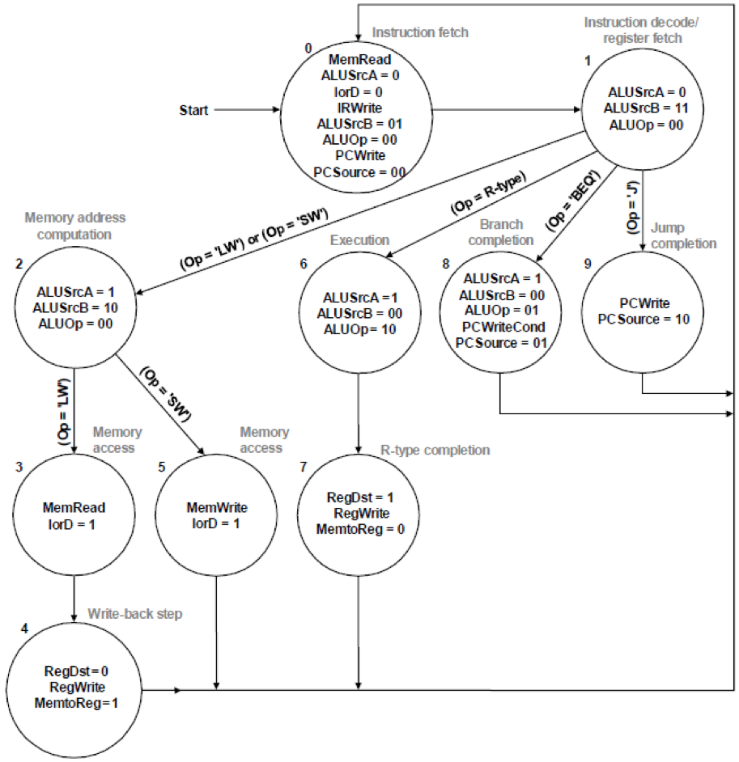
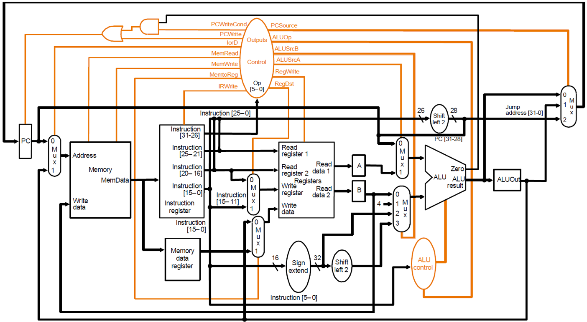
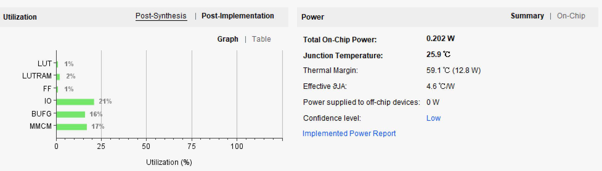
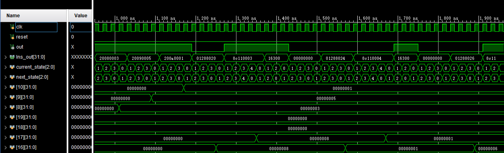
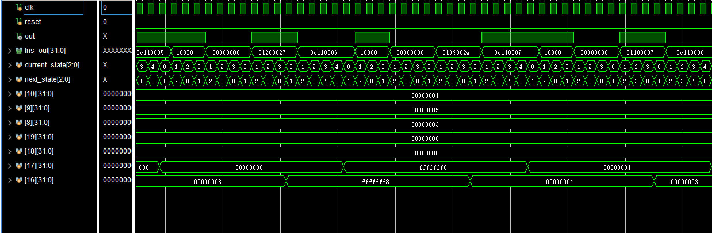

#计算机组成原理  实验报告
##实验题目
LAB05:多周期MIPS-CPU
##实验目的与内容
1. 理解多周期CPU的设计准则，掌握周期CPU的数据通路，合理编写数据通路；
2. 学习使用状态及编写控制模块 
3. 可执行指令：
   - add,sub,and,or,xor,nor,slt
   - addi,andi,ori,xori,slti
   - ls,sw
   - beq,bne,j
4. 运行示例汇编指令（附录1）


##实验平台
Vivado（2018.2)

##实验设计

###状态机于状态设计

如图所示，下图是不同指令对应的不同状态图：


在设计时，该状态机的定义与上图有所不同，没有采用对不同指令均设置不同状态，而是使用MIPS—CPU指令的五个状```IF,ID,EX,MEM,WB```。并在每个阶段里对于不同指令的 op 再使用 case 语句进行不同的信号输出与下一状态的选择，如此来实现不同周期的信号控制。

- IF ：取指阶段，进行对指令的提取及PC地址的自动操作。在这次设计中，由于按字寻址，所以PC每次加1而不是4；
- ID ：译指阶段，进行对指令的拆分和寄存器中数据的读取与 PC 地址的运算；  
- EX ：运算阶段，进行数据的运算，在分支与转跳指令中同时完成 PC 的写回；  
- MEM：访存阶段，进行从存储器中数据读出或写入，和寄存器的写回；   
- WB ：写回阶段，进行寄存器数据的写回。

###CPU模块
####数据通路
  先将各个模块搭建好，然后按照如下所示的数据通路连线即可。


1. PC 模块:
  对于 PC 模块，主要为一个随时钟周期变化的寄存器。重置输入给出每次指令存放的起始地址，本次设计中在重置信号 reset 变为 1 时将地址置 0，整个 CPU 开始执行第一条指令。对于使能输入，由于多周期中对 PC 值得写会可能出现在多个周期，故必须设置一个使能信号（PCen）来控制 PC 的写入，来控制PC的正确选择。
  
	```
	module PC(
    	input clk,
		input reset,
		input PCen,
    	input [31:0] newAddress,           
    	output reg[31:0] currentAddress  
    	);
	
    	always@(posedge clk or posedge reset)
    	begin
        if (reset) 
		  currentAddress <= 0;
		else if (PCen) 
		  currentAddress <= newAddress;
		else 
		  currentAddress <= currentAddress;
    	end

	endmodule
	```

2. Memory 模块:  
	
 根据本次实验的要求，将指令与数据存放在一个memory中，并调用IP核，采用 Block Memory 类型生成 Dual port RAM 来实现同步 RAM。同步 RAM 的写入和读出都需要一个额外的时钟周期，故对于状态机的信号控制也要进行调整，使得 RAM完成异步读异步写的效果。另外由于要同时存放指令与数据，对数据的分割会使实验结果较难观察，故使用 256*32bit 的 RAM，每个单元存放一条指令或数据，因此在 PC 值自加的 过程中将+4 改为+1，对于 beq,bne 和 j 指令则无需将对应的立即数或 26 位地址左移两位。
 
3. Control模块（具体代码过长，放在附录部分）:  
 Control 模块为本次多周期 CPU 设计的核心模块，完成了每个指令在不同周期对各个模块的不同控制。对 ALU 运算控制仍使用 Control+ALUControl 双模块实现。对多周期的控制信号如下:
 
	- PCSrc:2 位的 PC 地址的输入选择信号，用以选择新 PC 地址。
 	- LorD:存储器地址的输入选择信号，1选择 PC 值，0选择写回数据。
 	- ALUSrcA:ALUA 的输入选择信号，1选择A寄存器读出数据，0选择当前 PC 地址。
 	- ALUSrcB:2 位 ALUB 的输入选择信号，0选择使用B寄存器读出数据，1选择数字1，2选择扩展后的立即数，3选择扩展并左移两位的立即数。
 	- RegDst:Reg 写入地址的选择信号，0选择 rt 1选择rd。
 	- MemtoReg:写回寄存器的选择信号，用以选择写回存储器数据或 ALU 结果。
 	- PCWrite:PC 寄存器的使能信号，0选择PC模块的输出值，1选择ALUout寄存器的值。
 	- IRWrite:指令寄存器的使能信号，控制指令的改变。
 	- PCen:分支指令的使能信号，与 Zero 进行与运算来更改 PC 的使能信号。
 	- RegWrite:寄存器的写使能控制信号。
 	- MemWrite:数据存储器的写使能控制信号。
 	- ExtSel（自己加的）:位拓展器控制信号，1 代表有符号拓展，0 代表无符号拓展。
 	- Zero_Ctr：根据跳转指令来确定的0信号；
 	- Funct_im：I型指令的ALU控制信号；
	- ALUop:ALU 运算控制信号，输入 ALUcontrol 模块中得到二级控制信号。
 	- ALUControl:结合 funct 与 ALUop 给出的最终的 4 位的 ALU 控制信号。

  关于ALU的具体编码如下列表格所示：
  
  ALUOP | funct（6bits）/funct_imm(3bits) | ALUControl | ind
:-: | :-: | :-: | :-: 
10 | 100000 | 0010 | add 
10 | 100010 | 0110 | sub
10 | 100100 | 0000 | and
10 | 100101 | 0001 | or
10 | 100110 | 0111 | xor
10 | 100111 | 1100 | nor
10 | 101010 | 0011 | slt
00 | -      | 0010 | lw,sw
01 | -      | 0110 | beq,bne
11 | 000    | 0010 | addi
11 | 001    | 0000 | andi
11 | 010    | 0001 | ori
11 | 011    | 0111 | xori
11 | 100    | 0011 | slti


	         
4. 数据通路里的寄存器:
 由于在多周期中，每个周期数据在数据通路中均要有一周期的寄存，所以需在各个本来没有 clk 控制的数据通路上加入带 clk 的数据寄存器。下面依次分析数据通路中各个位置的数据寄存器:  
  1. RAM 的寄存器:
 因此对于本来的异步 RAM 需加入指令与数据寄存器，而对于修改后的同步RAM，由于异步读已经使得数据多了一周期的寄存时间，相当于已经实现了指令与数据寄存器的功能，故无需再添加该寄存器。但由于原设计中指令寄存器中有使能输入，而 若直接去掉会使得一条指令在运行中发生改变而导致错误，故在此将指令寄存器设计为一简单的锁存器，通过信号 IRWrite 来确认是否允许锁存器的输出被输入修改，即可完成对原数据通路的修改。

 2. 其余数据寄存器:
 其余寄存器包括主寄存器两个读出 RD1 与 RD2 的两个寄存器与 ALU 输出后的一个寄存器。这三个寄存器结构完全一样，均为一个含 clk 的触发器构成，故只需要写一个模块，例化时分别用在以上三处即可。
 
5.  Reg_Fiel 模块:
 由32个reg数组组成，该试验中除了0号寄存器不需要对他们进行区分。设置两个读端口，一个写端口。
 
 ```

	reg [31:0] register [31:0];
	integer i;
	initial 
    begin
		for(i = 0; i < 32; i = i + 1)  register[i] <= 0;
    end
	
	assign Read_Data1 = register[Read_Register1];
	assign Read_Data2 = register[Read_Register2];
    assign register_data=register[register_addr[4:0]];
	always @(posedge clk)
	begin
		if (wEna)
		begin
			if (Write_Register)
			register[Write_Register] <= Write_Data;
		end
	end
endmodule
 ```
 
6. ALU 模块:
 和前几次Lab做的ALU模块几乎一样，只是编码有所改动。
 
 ```
    assign zero=(Zero_Ctr)?(alu_out?1:0):(alu_out?0:1);
    always @(*)
    begin
    case (alu_op)
	    A_ADD : alu_out =   alu_a + alu_b ;
        A_SUB : alu_out =   alu_a - alu_b ;
        A_AND : alu_out =   alu_a & alu_b ;
        A_OR  : alu_out =   alu_a | alu_b ;
        A_XOR : alu_out =   alu_a ^ alu_b ;
        A_NOR : alu_out = ~(alu_a | alu_b);
        A_SLT : alu_out = ((alu_a < alu_b)? 1 : 0);
     default: alu_out = 32'h0;
    endcase
    end
 ```
 
7. 数据扩展器:
 该模块用于将 16 位立即数拓展为 32 位立即数，但由于不同情况下需要进行有符号和无符号扩展，故在扩展时，若为无符号扩展，只需在高 16 位补 0 即 可;若为有符号扩展，判断最高位第 16 位是否为 1，为 1 时在高 16 位补 1，不为 1 时在高 16 位补 0。如此即可完成对 16 位立即数的符号扩展。
 
 ```
 module SignExtend(
    input en,                
    input [15:0] Immediate,        
    output [31:0] Extend_Immediate   
    );

    assign Extend_Immediate[15:0] = Immediate;
    assign Extend_Immediate[31:16] = en ? (Immediate[15] ? 16'hffff : 16'h0000) : 16'h0000;
endmodul
 ```

8. 数据选择器:
 为使顶层模块相对简单，使用数据选择器模块。本次实验中需要使用到三种数据选择器，分别为 2 选 1、3 选 1 与 4 选 1 数据选择器。分别设计即可。  
 另外为了使程序更简洁，可以使用带参数的模块引用。即在定义 Mux 模块时，对于位数[31:0]使用[EM:0]代替，这样可以一次性实现任意位数的数据选择器，在引用模块时只需采用 Mux #(n) Muxn(......)的格式，即代表引入了
 一个 n 位的数据选择器。
 
##DDU模块
DDU（Debug and Dispaly Uint ）是调试和显示单元，主要的功能有：
 - 控制CPU运行方式，按一次按钮执行一条指令，或者是CPU按板载始终连续执行指令；
 - 查看CPU运行状态，根据地址查看Memory或Register_file的数据。

这里面的分频模块和数码管显示模块因为已经使用过很多次，这里就不再描述了，主要介绍以上两个功能。  

以下代码实现的是如何查看CPU的运行状态，因为在Memory 和 Register_File 中已经设计好异步读端口，所以在这里只需要根据信号（mem）进行选择就行

```
    assign memory_addr={24'b00000000_00000000_00000000,addr[7:0]};
    assign register_addr={27'b00000000_00000000_00000000_000,addr[4:0]};
    assign read= mem ? memory_data:register_data;
    assign led = mem ? memory_addr:register_addr;

```

对于控制CPU的运行方式，我的设计思路是设计一个二选一选择器，选择板载信号还是0信号，然后再根据状态机里的current_state 和 step信号组成选择信号，代码如下：

```
	 assign current_state_clk=(current_state_line==3'b000)? 1'b1:1'b0;
    assign clk_mux=cont? clk_slow:run;
    assign run=(run_signal)? clk_slow:1'b0;
    reg flag;
    
    always@(posedge step or posedge current_state_clk or posedge reset)
    begin
    if(reset)
        flag<=0;
    else if(current_state_clk==1&&step==0)
        run_signal<=0;
    else if(step==1&&current_state_clk==0)
        run_signal<=1;
    else if(step==1&&current_state_clk==1)
        begin
        if(flag==0)
            begin
            run_signal<=1;
            flag<=1;
            end
         else
            run_signal<=0;
        end
        
    else if(step==0&&current_state_clk==1)
        run_signal<=1;
    
    end
    

```
##实验结果
1. 电路性能
 
 
2. 仿真结果
 由于完整程序过长，这里只截了一部分图
 
 
  
 

##心得体会

1. 写CPU真的是一件不容易的事，而且已经已经极大的降低了我们的难度，因为数据通路已经是设计好了的，我们只需要在现有的基础上修改通路就可以了；
2. 有太多的细枝末节需要注意，一不小心就会出错，而且很难发现debug；
3. 对于大工程需要模块化才能有条不紊的进行设计与编写。

##附录

###init.coe

```
memory_initialization_radix  = 16;
memory_initialization_vector =
0800000a
00000000
00000000
00000008
00000001
00000006
fffffff8
00000001
00000003
00000005
00000000
20080003
20090005
200a0001
01288020
8c110003 
1630001d
00000000
01288024
8c110004
16300019
00000000
01288026
8c110005
16300015
00000000
01288027
8c110006
16300011
00000000
0109802a
8c110007
1630000d
00000000
31100007
8c110008
16300009
00000000
35300004
8c110009
16300005
00000000
ac09000a
8c11000a
11310003
00000000
ac000008
0800002e
ac0a0008
08000030
```

###CPU module

```
module MulticycleCPU(
	input clk,
	input reset,
	input  [31:0] memory_addr,
	output [31:0] memory_data,
	input  [31:0] register_addr,
    output [31:0] register_data,
    output [2:0] current_state_line
	);
	
	wire [1:0] ALUop,ALUSrcB,PCSrc;
	wire [2:0] Funct_im;
	wire [3:0] ALUControl;
    wire [4:0] Write_Register;
    wire [31:0] Read_Data1,Read_Data2,Write_Data;
	wire [31:0] A,B,newAddress,Mem_Data,Mem_Data_out,currentAddress,ALU_out,memaddr,Ins_out,ALU_A,ALU_B,ALUOut;
    wire [31:0] Extend_Immediate,JumpAddress;   
	
    wire Zero,lorD,PCen,Branch,PCWrite,IRWrite,ALUSrcA,RegWrite,MemtoReg,MemWrite,ExtSel,RegDst,Zero_Ctr;

	//assign out=Ins_out;
	assign PCen=(~Zero&Branch)|PCWrite;
	assign JumpAddress={currentAddress[31:28],Ins_out[25:0]};
	
	PC pc(clk,reset,PCen,newAddress,currentAddress);
	
	Mux Mux_lord(lorD,ALUOut,currentAddress,memaddr);
	
    ins_Data_Memory  Memory(
        .clk(clk),
        .we(MemWrite),
        .a(memaddr[7:0]),
        .d(B),
        .spo(Mem_Data),
        .dpra(memory_addr),
        .dpo(memory_data)
        );  
        
	InstrReg Instruction_reg(IRWrite,Mem_Data,Ins_out);
	
    Control control(clk,reset,Ins_out[31:26],PCSrc,ALUSrcA,ALUSrcB,lorD,MemtoReg,IRWrite,RegWrite,MemWrite,ExtSel,RegDst,Branch,PCWrite,ALUop,Zero_Ctr,Funct_im,current_state_line);

	Reg_clk Memory_data_register(clk,Mem_Data,Mem_Data_out);
	
	Mux Mux_MemtoReg(MemtoReg,Mem_Data_out,ALUOut,Write_Data);
	
	Mux #(4)Mux_RegDst(RegDst,Ins_out[15:11],Ins_out[20:16],Write_Register);
	
	REG_FILE Register_File(
	   .clk(clk),
	   .wEna(RegWrite),
	   .Read_Data1(Read_Data1),
	   .Read_Data2(Read_Data2),
	   .Write_Register(Write_Register),
	   .Write_Data(Write_Data),
	   .Read_Register1(Ins_out[25:21]),
       .Read_Register2(Ins_out[20:16]),
       .register_addr(register_addr),
       .register_data(register_data)
	   );
	   
	Reg_clk RegA(clk,Read_Data1,A);
	
	Reg_clk	RegB(clk,Read_Data2,B);
	
	SignExtend signex(
	   .en(ExtSel),
	   .Immediate(Ins_out[15:0]),
	   .Extend_Immediate(Extend_Immediate)
	   );
	   
    Mux	Mux_SrcA(ALUSrcA,A,currentAddress,ALU_A);
    
    Mux4to1 Mux_SrcB(ALUSrcB,B,32'd1,Extend_Immediate,Extend_Immediate,ALU_B);
    
	ALUcontrol ALU_con(
	.ALUop(ALUop),
	.funct(Ins_out[5:0]),
	.funct_imm(Funct_im),
	.ALUControl(ALUControl)
	);
	
	ALU alu(
	.alu_a(ALU_A),
	.alu_b(ALU_B),
	.alu_op(ALUControl),
	.Zero_Ctr(Zero_Ctr),
	.alu_out(ALU_out),
	.zero(Zero)
	);
	
	Reg_clk	Reg_ALU(clk,ALU_out,ALUOut);
	
	Mux3to1 MuxPC(PCSrc,ALU_out,ALUOut,JumpAddress,newAddress);
	
endmodule
```

###control module 

```
module Control(
	 input clk,
	 input reset,
	 input [5:0] op,                  // op操作符
	 output reg [1:0] PCSrc,         // PC多路选择器
     output reg ALUSrcA,
	 output reg [1:0] ALUSrcB,       // ALU多路选择器
	 output reg lorD,
     output reg MemtoReg,            // 多路选择器
	 output reg IRWrite,
     output reg RegWrite,            // (RF)写使能信号，为1时，在时钟上升沿写入
     output reg MemWrite,            // (DM)数据存储器读写控制信号，为1写，为0读
     output reg ExtSel,              // (EXT)控制补位，如果为1，进行符号扩展，如果为0，全补0
     output reg RegDst,              // 多路选择器
	 output reg Branch,
	 output reg PCWrite,
	 output reg [1:0] ALUop,
	 output reg Zero_Ctr,
	 output reg [2:0] Funct_im,
	 output [2:0] current_state_line
);
reg [2:0] current_state,next_state;
wire [2:0] current_state_line;
assign current_state_line=current_state;
parameter [5:0]  R_type = 6'b000000,
                  addi   = 6'b001000,
                  andi   = 6'b001100,
                  ori    = 6'b001101,
                  xori   = 6'b001110,
                  slti   = 6'b001010,   
                  sw     = 6'b101011,  
                  lw     = 6'b100011,
			      bqtz   = 6'b000111,
			      beq    = 6'b000100,
			      bne    = 6'b000101,
                  j      = 6'b000010,   
                  halt   = 6'b111111;

parameter [2:0] //IDLE = 3'b111,
			     IF   = 3'b000,   
                 ID   = 3'b001,  
                 EX   = 3'b010,  
                 MEM  = 3'b011,  
                 WB   = 3'b100;

    always @(posedge clk or posedge reset) 
    begin
	   if (reset)
	       begin
	       current_state <= IF;
	       //current_state <= IDLE;
	       //IRWrite <= 1;
	       end
	   else 
           current_state <= next_state;
    end

    always@(*)
    begin
    case(current_state)
    /*
	        IDLE: 
	           next_state <= IF;
	*/
            IF: 
               next_state <= ID;
            ID: 
               next_state <= EX;
		    EX: 
			     begin
			     if (op == bqtz||op == j||op ==beq||op ==bne)
			         next_state <= IF;
			     else
			         next_state <= MEM;
			     end
			MEM: 
			     begin
			     if(op == lw)
			         next_state <= WB;
			     else
			         next_state <= IF;
			     end
			WB: 
			     next_state <= IF;
			default:;
		endcase
	end

    always@(posedge clk or posedge reset)
    begin
	   lorD <= 0;
	   Branch <= 0;//
	   PCWrite <= 0;
	   IRWrite <= 0;
	   RegDst <= 0;
	   ALUSrcA <= 0;
	   ALUSrcB <= 2'b01;
       ExtSel <= 0;//
       RegWrite <= 0;
       MemWrite <= 0;
       MemtoReg <= 0;
	   ALUop <= 2'b00;
	   PCSrc <= 2'b00;
	   Zero_Ctr <= 0;
	   Funct_im <= 3'b000;
	if (reset) ;
	else
	   begin
	   case (next_state)

		IF:
		  PCWrite <= 1;
		
		ID:
		  begin
		  ALUSrcB <= 2'b11;
		  IRWrite <= 1;
		  ExtSel <= 1;
		  end
		
		EX:
		  begin
		  case(op)
	      lw,sw:
	           begin
			   ALUSrcA <= 1;
			   ALUSrcB <= 2'b10;
			   ExtSel <= 1;
			   end
			
		  R_type:
		      begin
			  ALUSrcA <= 1;
			  ALUSrcB <= 2'b00;
			  ALUop <= 2'b10;
			  end
			
		  bne:
		      begin
              ALUSrcA <= 1;
              ALUSrcB <= 2'b00;
              ALUop <= 2'b01;
              PCSrc <= 2'b01;
              Branch <= 1;
              ExtSel <= 1;
              Zero_Ctr <= 0;
              end
		  beq:
		      begin
              ALUSrcA <= 1;
              ALUSrcB <= 2'b00;
              ALUop <= 2'b01;
              PCSrc <= 2'b01;
              Branch <= 1;
              ExtSel <= 1;
              Zero_Ctr <= 1;
              end

			
		  addi:
		  begin
                        ALUop <= 2'b11;
                        ALUSrcA <= 1;
                        ALUSrcB <= 2'b10;
                        ExtSel <= 1;
                        Funct_im <= 3'b000;
                        end
		  
		  andi:
		  begin
                        ALUop <= 2'b11;
                        ALUSrcA <= 1;
                        ALUSrcB <= 2'b10;
                        ExtSel <= 1;
                        Funct_im <= 3'b001;
                        end
		  ori:
		  begin
                        ALUop <= 2'b11;
                        ALUSrcA <= 1;
                        ALUSrcB <= 2'b10;
                        ExtSel <= 1;
                        Funct_im <= 3'b010;
                        end
		  xori:
		  begin
                        ALUop <= 2'b11;
                        ALUSrcA <= 1;
                        ALUSrcB <= 2'b10;
                        ExtSel <= 1;
                        Funct_im <= 3'b011;
                        end
		  slti:
		      begin
		      ALUop <= 2'b11;
			  ALUSrcA <= 1;
			  ALUSrcB <= 2'b10;
			  ExtSel <= 1;
			  Funct_im <= 3'b100;
			  end
			
		  j:
		      begin
			  PCSrc <= 2'b10;
			  PCWrite <= 1;
			  end
		endcase
		end
		
		MEM:
		  begin
		  case(op)
			lw:
			     lorD <= 1;
			sw:
			     begin
			     lorD <= 1;
			     MemWrite <= 1;
			     end
			R_type:
			     begin
			     RegDst <= 1;
			     RegWrite <= 1;
			     end
			addi,andi,ori,xori,slti:
			     RegWrite <= 1;
			endcase
		end
		 
		WB:
		begin
			MemtoReg <= 1;
			RegWrite <= 1;
		end
		default:;
	endcase
	end
end


endmodule

```

