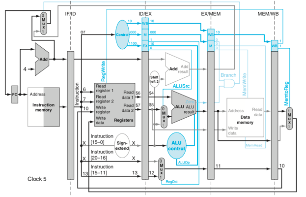
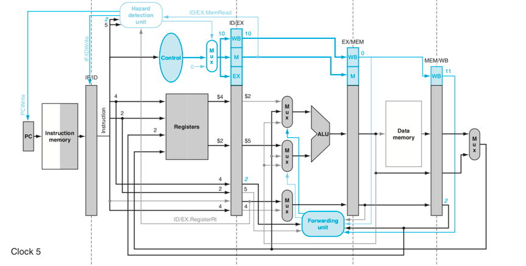

#计算机组成原理  实验报告
##实验题目
LAB06:MIPS-CPU
##实验目的与内容

1. 自行设计一个流水线MIPS CPU
	- 理解流水线CPU的设计准则
	- 自行设计流水线CPU的数据通路，实现基础的MIPS5级流水
	- 学习流水线MIPS CPU的信号控制与信号的寄存模块
	- 思考流水线、多周期与单周期的本质区别
 	- 处理流水线的相关与冒险，加入转发的数据通路与Forwarding模块
   - 处理Lw的数据相关，加入互锁interlock模块
	- 处理分支时的控制相关，默认分支失败从失败处调度
2. 增加流水线所能执行的指令条数（最终实现48条指令）
	- 根据原本的数据通路添加基础的逻辑运算指令
	- 适当添加ALU的输出信号来增加更多分支指令
	- 修改数据通路并添加模块来添加更多访存和跳转指令
3. 根据设计的CPU实现下载，在实验板上完成指令执行和内存数据的输出
	- 实现下载并成功运行指令
	- 将内存中存储结果自动滚动输出在数码管上
	- 根据开关手动输入地址，显示对应内存地址的内容


##实验平台
Vivado（2018.2)

##实验源码
https://github.com/sakura0423/CPU_layout

##实验设计

###一. 五级流水线基础数据通路的设计
 对于基础的流水线数据通路，由类似单周期CPU的数据通路调整而成，本次实验初期使用如下的流水线数据通路：
 

###二.流水段内模块的设计
####IF段

1. PC 模块  
	对于PC模块，主要为一个随时钟周期变化的锁存器。与单周期主要的区别为加入了使能输入与重置输入。重置输入给出每次指令存放的起始地址，本次设计中在重置信号reset变为1时将地址置0，整个CPU开始执行第一条指令。（有关使能输入在后面interlock设计内补充）

2. 指令寄存器  
	指令存储器直接由IP核生成，由于指令存储器内内容无需修改，切为了保证每条指令不会因为错误操作被修改，故选用Distribution Memory类型生成ROM（只读存储器），此存储器可实现同步读，输出随输入地址直接变化，且无时钟周期信号，不受时钟信号影响。  
另外由于取出时为一次性取出32位指令，使用IP核难以合成8位的指令，故直接使用128*32bit的ROM，每个单元存放一条指令或数据，而为了处理本来指令中对PC地址均按照4的倍数自加的问题，在ROM地址输入端将输入地址右移两位，即处理了对应的地址自加错误的问题。


3. PC 地址的数据选择器  

  二选一的32位数据选择器，由Branch与Zero信号的与运算构成该选择器的信号输入，0代表使用上一地址自加获得的地址，1代表分支成功时应转跳的地址，输出结果即为PC的下一个新地址。

####IF/ID寄存器

   在流水线中为了完成每个指令在每个周期完成一个流水段的要求，需在5个流水段的分段间隙中加入段寄存器，主要用于寄存需要输入下一流水段的各数据，各个段寄存器中由一系列子寄存器组成，为了完成后续对流水段的清空操作，子寄存器加入重置信号。   
    对于IF/ID段寄存器，只需寄存两个数据：当前指令（32位）和下一个PC值（32位）。（对于该段寄存器的使能控制在后续加入）
    
    
####ID段

1. 主寄存器REG模块：  
	Reg模块的设计基本与之前相同，加入了reset对寄存器文件的初始化以及另外添加了一个对于0号寄存器的优化：即$zero寄存器中始终存储0，且无法写入0号寄存器。
	
2. 信号控制模块：  
	流水线CPU信号控制模块的设计主要类似单周期CPU的设计，即在ID段中就给出所有的输出信号，初始的基础控制信号主要有以下几个：
	- REG段控制信号
		- ExtSel：位拓展器控制信号，1代表有符号拓展，0代表无符号拓展。
	- EX段控制信号：
		- ALUSrc： ALUB的输入选择信号，用以选择使用reg读出数据和立即数。
		- RegDst：Reg写入地址的选择信号，用以选择rt或rd输入寄存器写入地址。
		- ALUop：2位ALU运算控制信号，输入ALUcontrol模块中得到二级控制信号。
	- MEM 段控制信号：
		- Branch：分支指令的使能信号，与Zero进行与运算来更改PC的使能信号。
		- MemWrite：数据存储器的写使能控制信号。
		- MemRead：数据存储器的读使能控制信号。
	- WB段控制信号：
		- MemtoReg：写回寄存器的选择信号，用以选择写回存储器数据或ALU结果。
		- RegWrite：寄存器的写使能控制信号  
		
		对于不同指令信号对应的值同多周期，对于输出的后面三个分段的信号，在每个流水段寄存器中再分级寄存，以此来实现信号随流水段分配到各个模块中。


3. 立即数位数扩展器：  
	该模块用于将16位立即数拓展为32位立即数，但由于不同情况下需要进行有符号和无符号扩展，故在扩展时，若为无符号扩展，只需在高16位补0即可；若为有符号扩展，判断最高位第16位是否为1，为1时在高16位补1，不为1时在高16位补0。如此即可完成对16位立即数的符号扩展。


####ID/EX段寄存器
   对于ID/EX段寄存器，需寄存从信号控制模块传输来的EX、MEM、WB三段信号，以及下一个PC值、寄存器两个端口的读出值、位拓展后的立即数以及指令中的rt和rd。


####EX段

1. ALU模块  
	ALU模块也大体保持之前CPU中的设计，对于zero输出改为使用assign语句而不再和case(op)放在一个always语句中，使程序结构更清晰。但对于更多指令中ALU还需要添加一系列信号，在后文中提出。

2. ALU信号控制模块  
	大体同多周期的设计，由ALUop信号和funct生成对应的ALU控制信号。
	
 ALUOP | funct（6bits）/funct_imm(3bits) | ALUControl | ind
:-: | :-: | :-: | :-: 
10 | 100000 | 0010 | add 
10 | 100010 | 0110 | sub
10 | 100100 | 0000 | and
10 | 100101 | 0001 | or
10 | 100110 | 0111 | xor
10 | 100111 | 1100 | nor
10 | 101010 | 0011 | slt
00 | -      | 0010 | lw,sw
01 | -      | 0110 | beq,bne
11 | 000    | 0010 | addi
11 | 001    | 0000 | andi
11 | 010    | 0001 | ori
11 | 011    | 0111 | xori
11 | 100    | 0011 | slti
	
3. REG地址的数据选择器
	用于选择rt还是rd作为传入下一阶段的地址，信号控制为RegDst。

####EX/MEM段寄存器

对于ID/EX段寄存器，需寄存从上一段寄存器传输来的MEM、WB两段信号，以及下一个PC加左移两位立即数的值、ALU的输出结果、Zero的输出结果、从寄存器第二个端口读出的数据、经选择器选的出的地址。


####MEM段

1. 数据存储器  
 数据存储器同样由Distribution Memory生成，具体选项选择Simple port RAM，即单端口的可写入存储器，注意设置一个读出的使能，用以输入MemRead信号。


####MEM/WB段

对于ID/EX段寄存器，需寄存上一段寄存器传输来的WB段信号，以及数据存储器的读出结果、ALU的输出结果、从上一段寄存器传入的地址。

####WB

1. 写回内容的数据选择器：  
	用以选择写回寄存器的内容，控制信号为MemtoReg。


####顶层模块PipelineCPU的设计
  对于顶层模块，主要为对各个流水段及对应段内模块的连线，以及对拓展后立即数的左移两位等操作。
  
###三.流水线CPU相关问题的处理与模块设计

  在完成了流水线基本数据通路的设计以后，还需处理诸多流水线中的相关问题，对于结构相关，由于是硬件的设计问题，故暂不考虑;对于数据相关，分为forwarding和interlock两块来处理。对于分支相关，使用默认分支不成功的情况，成功时清空EX段前的流水线。
  
  1. 转发模块与数据通路的设计  
  
	使用转发的数据通路来处理大多数数据相关问题，设计的数据通路如下图，新建一个forwarding模块用以判断各个数据通路间是否需要转发，当转发条件达成时，即连接对应的数据通路，通过增加两个三端口数据选择器来完成选择。不需要转发时，默认直选择原数据通路的数据。

  
  2. 指令锁的设计  
 
   对于跨多周期的lw+R型指令，由于当R指令读出的寄存器数据进ALU时，lw指令所需取出的数字也仍未读出，故即使用转发也无法处理改相关，只能使用一个指令锁结构，在lw后向- 比较类：slt、sltu、slti、sltui
流水线中插入一个气泡指令来使流水线暂停工作一周期，此时应控制PC和IF段寄存器保持之前的值不变，转而向ID段寄存器的信号寄存部分插入一个全0的信号，即可实现插入一条气泡，从而使流水线暂停工作一周期来解决对应的相关问题。

  

###四.增加命令所需调整的数据通路

####增加各类算术逻辑指令

1. 实现指令
	- 算术逻辑类：add、addu、sub、subu、and、or、nor、xor
	- 立即数运算类：addi、addiu、andi、ori、xori、lui
	- 位运算类：sll、sllv、srl、srlv、sra、srav
	
2. 具体实现方式：  

	对于要加入的基本算术逻辑类指令，原ALU中也已基本实现，只需加入对应的运算和在ALUControl中的判断语句即可。  
对于立即数运算类，由于要加入的指令较多，而本来的ALUop只有2位，最多只能再增加三个立即数运算，而此处为了添加四个，只能将原ALUop的位数改为3位，即可在ALUControl中直接将对应的运算输出对应算术逻辑类指令的信号。对于较为特殊的lui，该指令将立即数的低16位存入rt寄存器的高16位（低16位补0），因此在ALU中加入一个运算`ALU_ LUI`，直接将输入端B的低16位赋值给`alu_out`的高16位，`alu_out`的低16位直接赋值为0，再将次结果写回即可。
对于位运算类，需在ALU中新增位运算的控制，对于逻辑左移与逻辑右移，直接用<<与>>即可。而对于有些特殊的算术右移，Verilog中本来设置有算术右移符号>>>，但实际运用时存在问题，查找相关资料后得知对前者的`alu_a`前端加上`$sighed(alu_a)`后即可使用>>>。  
对于比较类，直接在ALU中添加运算，当`alu_a大于（或小于）alu_b时，alu_out`赋值为1，否则赋值为0即可实现。


####增加存数和取数指令

1. 实现指令：  
	- 存数指令：sw、sb、sbu
	- 取数指令：lw、lb、lbu、lh、lhu

2. 具体实现方式：  

	对于存数与取数指令不同位数的选择，由于数据存储器设置为32位且一次就会读出32位，所以可添加模块来根据不同的存取数模式将本来读出的32位数字改为所要求的8、16、32位数，具体的实现主要由组合逻辑即可实现，不过由于需要保存存数和取数的信号信息，所以需在MEM阶段插入两个信号，存数信号`store_mode(2位)`与取数信号`load_mode(3位)`，再加入两个数组组合逻辑模块，即可实现对应的不同模式存取数。


####增加分支指令

1. 实现指令： 
	- 分支指令：bltz、beq、bne、blez、bgtz
	- 分支并链接指令：bgezal、bltzal
	
2. 具体实现方式：  

	由于之前要实现的分支类指令只有一种，故Zero输出的要求为固定的，不需要多余的信号输入，而现在对于不同的分支指令，虽然大多是用alu的sub运算，但其Zero输出1或0的条件要根据不同指令而变化，因此要对ALU加入一个Zero输出条件选择的`AluzeroCtr`控制信号，由于模式较多，故该信号为3位且应插入EX段信号中。根据该信号的不同，ALU中即可选择Zero输出1时对应的要求，即到底是在`alu_out`等于0时输出1还是不等于0时输出1，以及对于两条链接指令，需直接判断`alu_a`与0的关系。  
	
	对于后面的两天分支并链接指令，即分支成功时还需把分支的PC值存入31号寄存器中，故设计此时添加一个信号connect在MEM段中，用以确定是否要链接，当需要链接时connect置为1，代表需要链接。此时再在MEM/WB段寄存器前加入一个2选1数据选择器，控制信号即为connect，当信号为0时写回地址仍未之前RegDst确定的地址，信号为1时写回地址直接为常数31。  
	
	确认了链接时写回的寄存器之后，还需结果此时的RegWrite的信号问题，由于之前RegWrite的信号在默认时为0，且由于存在分支不成功无需链接的可能，所以不能在Control模块中直接把RegWrite置为1。个人解决该方法的问题为：将connect信号从MEM段再寄存一次进入WB段中，此时在输入寄存器的写入使能信号前加上一数据选择器，信号控制即为寄存后的connect，当connect为0时保留原来的RegWrite信号值，当connect为1时直接输出常数1，如此即可确保分支不成功时不会错误地把地址写回寄存器中。  
	
	另外由于本来在WB段已没有分支成功时的PC地址，故还需要将分支成功的地址通过段寄存器寄存到WB段中，同时修改MemtoReg信号为2位，即可多选择一个PC地址作为写回的数据可能之一。  
	
	最后由于分支指令目前为预测分支失败，所以当分支成功时，需要清空目前多进入流水线的后面3条指令，只需要将MEM段寄存器及之前寄存器的`reset_p`置0，即可将之前已经进入流水线的指令清除，决定reset_p的可以简单的为PCSrc，即为Branch、Zero与jump组合而成，当PCSrc为1时，设置reset转为1，当PCSrc为0时，设置reset为1保持不变。

####增加跳转指令

1. 实现指令：
	- j、jr、jal、jalr
	
2. 具体实现方式：
  
	对于跳转指令，由于之前的流水线通路中没有考虑，故需要重新修改通路来实现，主要是将指令的后26位寄存并组合原地址到MEM段，同时为了实现转跳，加入信号jump，当指令为转跳指令时，jump为1，其余时候为0。jump指令插入MEM段中，修改本来新地址的选择信号，本来由Branch和Zero的与运算组成，现在需再并上jump，即只要jump为1，直接置新地址。 
	
	对于jr指令，即从寄存器中读取转跳指令PC，由于其rt对应为$zero寄存器，故直接设置ALU为加运算即可，然后可得ALU的运算结果即为新地址。由于此时新PC的改变值已有3中可能（改变值不包括自加的PC+4值），分别为分支成功时地址，跳转的tar地址，寄存器存储的地址，故要在MEM段插入新信号PCbackSrc与一个3选1数据选择器，用于确认改变后的PC值。
对于jal与jalr的链接指令，和上述分支并链接的指令实现方法相似，估值徐此时设置信号connect为1即可实现链接。
 
 
###五.实现下载所需添加及修改的模块
 为实现下载需要，即在板子上运行CPU执行一段指令，并输出执行完成后对应的数据存储器中的内容，因此再设计一顶层模块在Pipeline之上，并加入以下几个模块来实现操作板上的控制：
 
1. 时钟减缓模块

	用于增加每个时钟周期的时间，以使得八段数字显示器的数字变化在肉眼观察范围内。另外由于需要自动现实存储内的数据，需要再加入一个自动输入读取地址的模块，对于该模块也需要一个减慢的时钟输入。

2. 按键防抖动模块

	由于在每次触碰按键时可能会有多次触碰，故使用按键切换模式时需加入该模块用于确认按键的点按次数并防止抖动的多次输入。
3. 地址自动读取模块

	为实现内存的自动读取，需在每个延缓的时钟周期输入新的读取地址，因此加入该模块用以顺序输出从1到128的地址，并加入rst_n信号来实现每次自动读取地址的重置。
	
4. 七段式显示器的控制模块

	用于控制七段式显示器输出对应的数字（输出结果为16进制）。
	
5. top模块的设计

	对于该实现下载的顶层模块，加入上述模块后，还需要加入一个模式的选择，使用一个always结构来时变量mode在0和1间切换从而实现显示器在两种模式间的切换。另外对于原CPU的顶层模块PipelineCPU，还需略有更改，即加入一个对数据存储器的读取地址，以及对应地址的输出，为不干扰原CPU的运行，故将数据存储器改为双端口的Dual Port RAM，以此来分出一个端口来读取当前下载所需读取地址的数据。


##实验应用及检测

####计算斐波拉契数列：

汇编程序：

```
addi   $t0, $zero,0       
      addi   $t5, $zero,20       
      addi   $t3,$zero,3	   
      addi  $t4,$zero,3
      sw   $t3, 0($t0)      # F[0] = $t3
      sw   $t4, 1($t0)      # F[1] = $t4
      addi $t1, $t5, -2     
loop: lw   $t3, 0($t0)      # Get value from array F[n] 
      lw   $t4, 1($t0)      # Get value from array F[n+1]
      add  $t2, $t3, $t4    # $t2 = F[n] + F[n+1]
      sw   $t2, 2($t0)      # Store F[n+2] = F[n] + F[n+1] in array
      addi $t0, $t0, 1      # increment address of Fib. number source
      addi $t1, $t1, -1     # decrement loop counter
      bgtz $t1, loop        # repeat if not finished yet.
out:  
j out

```

##写在最后
1. 从多周期到流水线，数据通路发生了巨大变化，其中需要注意的细节数不胜数，常常因为一些小小的细节导致BUG，可见CPU的结构之精细；
2. 通过写各个指令阶段和流水冲突的处理，对流水线有了深刻的认识，但是此时的流水线还是一个初步的不成熟的效率较低的，分支预测等功能都没有加上；
3. 感谢助教和老师一学期以来的辛勤付出！
